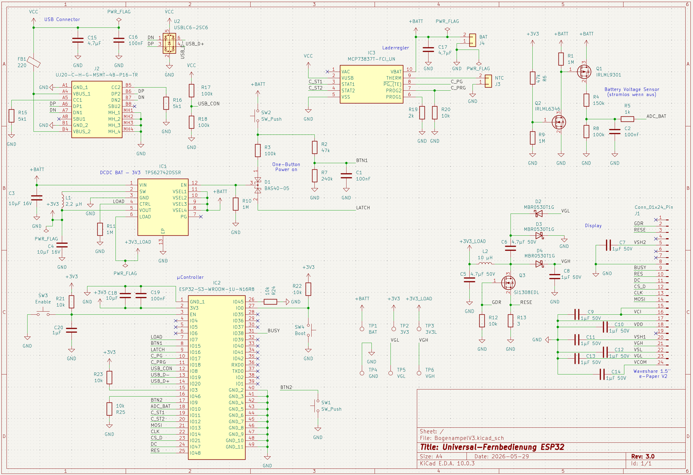

# Bogenampel

Eine funkgesteuerte Timer-Anzeige für Bogenschießplätze.
Sie funktioniert möglichst einfach, mit minimalen Benutzereingaben:
An der Bedieneinheit wird der Modus (120 oder 240 Sekunden, 1-2 oder 3-4 Schützen)
vorausgewählt, danach steuern zwei Taster den kompletten Turnierablauf.

Die Anlage besteht aus zwei Geräten:

- **Sender (Bedieneinheit)** — liegt an der Schießlinie, e-Paper-Display, akkubetrieben
- **Empfänger (Anzeigeeinheit)** — steht am Ziel, große 7-Segment-LED-Anzeige mit Ampelfarben



## Hardware

| | Sender (Bedieneinheit) | Empfänger (Anzeigeeinheit) |
|---|---|---|
| **Controller** | ESP32-S3-WROOM-1U-N16R8 (16 MB Flash, 8 MB PSRAM) | Seeed XIAO ESP32C3 |
| **Anzeige** | 1.54″ e-Paper, 200×200 (SSD1681) | LED-Strip WS2811 12 V, 158 LEDs |
| **Funk** | ESP-NOW, Kanal 1 (im Chip integriert) | ESP-NOW, Kanal 1 |
| **Versorgung** | LiPo-Akku + MCP73837-Lader, USB-C | 12 V extern oder 5 V USB (JP1) |
| **Bedienelemente** | 2 Taster (CONFIG, OK) | Debug-Taster, 3 Potis |
| **Sonstiges** | Soft-Power-Latch (TPS62742) | Piezo 12 V, geregelter Lüfter |
| **Firmware** | [`Sender/`](Sender/) | [`Empfaenger/`](Empfaenger/) |
| **Schaltplan** | [`Schaltung-Sender/`](Schaltung-Sender/) | [`Schaltung-Empfaenger/`](Schaltung-Empfaenger/) |

Die verbindliche Pin-Belegung steht in
[`specs/004-v3-esp32-port/contracts/hardware-pins.md`](specs/004-v3-esp32-port/contracts/hardware-pins.md)
und wird aus den KiCad-Netzlisten abgeleitet. Bei Abweichungen gilt der Schaltplan —
Änderungen gehören zuerst dorthin, dann in den Code.

Die 158 LEDs verteilen sich auf 16 LEDs Gruppe A/B, 16 LEDs Gruppe C/D und
3 × 42 LEDs für die dreistellige 7-Segment-Anzeige.

## Bedienung

Der Sender hat zwei Taster. Welcher Taster einschaltet, legt der Power-Latch in der
Hardware fest — das ist die **CONFIG**-Taste.

| Taste | kurz | 2 s halten | 3 s halten |
|---|---|---|---|
| **CONFIG** | Weiter / Wert ändern | — | Ausschalten |
| **OK** | Bestätigen / Passe beenden | Alarm (im Schießbetrieb) | Ausschalten |

Einschalten: CONFIG drücken. Ausschalten: eine der beiden Tasten 3 Sekunden halten.
Die Konfiguration (Schießzeit, Schützenzahl) bleibt im NVS erhalten und steht beim
nächsten Einschalten wieder zur Verfügung.

## Ablauf einer Passe

| Phase | Anzeige | Dauer |
|---|---|---|
| **Stopp** | Rot, `000` | bis zum Start |
| **Vorbereitung** | Rot, Countdown | 10 s |
| **Schießzeit** | Grün, Countdown | 120 s oder 240 s |
| **letzte 30 s** | Orange, Countdown | 30 s |
| **Ende** | Rot, `000` | — |

Der Piezo quittiert die Phasenwechsel mit kurzen Tonfolgen (3250 Hz), das Passenende
mit drei Tönen. Ein ausgelöster Alarm blinkt und piept achtmal.

**Wichtig für die Sicherheit**: Der Empfänger zählt eine gestartete Passe **autonom**
zu Ende. Fällt der Funk aus oder geht der Sender aus, läuft der Timer korrekt ab und
schaltet danach auf Rot — er bleibt nicht in Grün stehen.

### Gruppen und halbe Passe

Bei 3-4 Schützen wird zwischen den Gruppen A/B und C/D umgeschaltet; die Anzeige folgt
einem 4er-Zyklus. Zusätzlich lässt sich eine halbe Passe starten, wenn nur noch die
zweite Gruppe schießt.

## Funk

ESP-NOW auf Kanal 1, ohne externes Funkmodul und ohne Pairing: Der Sender sucht den
Empfänger beim Start per Broadcast und merkt sich dessen MAC-Adresse zur Laufzeit.

Jeder Frame ist 6 Byte groß und trägt Magic-Bytes, eine Prüfsumme und eine
Sequenznummer; der Empfänger verwirft doppelte und fehlerhafte Pakete. Übertragen
werden 11 Kommandos (Start 120/240, Stopp, Init, Alarm, Ping, Gruppenwahl, halbe Passe).
Beim Start misst der Sender die Verbindungsqualität mit 10 Pings und zeigt das Ergebnis
im Splash-Screen.

> **Ein Radio, ein Kanal.** Der ESP32 kann nicht gleichzeitig ESP-NOW auf Kanal 1 und
> WLAN auf einem anderen Kanal betreiben. Deshalb läuft im Normalbetrieb **kein** WiFi —
> weder ein Accesspoint noch eine Netzwerkverbindung. Für Updates gibt es den
> Wartungsmodus (siehe unten).

## Bauen und Flashen

PlatformIO ist der einzige unterstützte Build-Pfad. Die `platformio.ini` liegt **zentral
im Repo-Root**, nicht in den Firmware-Ordnern — das Repo-Root ist das Arbeitsverzeichnis.
Bibliotheken kommen versioniert über `lib_deps`, es muss nichts manuell installiert werden.

```bash
pio run -e sender                 # bauen
pio run -e empfaenger

pio run -t upload -e sender       # per USB flashen
pio device monitor -e sender      # 115200 Baud
```

Zwei Stolpersteine, die beide wie Hardwaredefekte aussehen:

**Beim Sender muss CONFIG während des gesamten Uploads gedrückt bleiben.** Der Reset von
esptool lässt sonst den Power-Latch fallen; das Gerät schaltet sich mitten im Flashen ab
und der USB-Port verschwindet.

**Unter Windows vor jedem Upload `$env:PYTHONIOENCODING="utf-8"` setzen.** Sonst bricht
der Vorgang mit `UnicodeEncodeError` und `[upload] Error 4294967295` ab — esptool schreibt
Unicode-Fortschrittsbalken, die eine cp1252-Konsole nicht kodieren kann. Auf den Chip
wurde zu diesem Zeitpunkt noch nichts geschrieben.

### OTA-Wartungsmodus

Beide Geräte lassen sich drahtlos aktualisieren, aber nur in einem eigenen Betriebsmodus —
im Normalbetrieb ist WiFi aus (siehe Kasten oben).

- **Sender**: beide Taster gleichzeitig gedrückt halten und einschalten
- **Empfänger**: mit gehaltenem Debug-Taster (D7) einschalten

Der Sender zeigt daraufhin einen Wartungs-Screen mit WLAN-Status und **seiner eigenen
IP-Adresse**; beim Empfänger signalisiert die Status-LED durch langsames Blinken, dass er
bereit ist. Die IP wird als `upload_port` in der `platformio.ini` eingetragen (eine feste
DHCP-Reservierung ist empfehlenswert, mDNS-Namen lösen über Subnetzgrenzen nicht
zuverlässig auf).

```bash
pio run -t upload -e sender-ota
pio run -t upload -e empfaenger-ota
```

Voraussetzung ist eine `wifi_credentials.h` im Repo-Root — Vorlage:
[`wifi_credentials.h.example`](wifi_credentials.h.example). Die Datei ist bewusst nicht
eingecheckt. Fehlt sie, meldet der Wartungsmodus das auf dem Display und wartet; einen
Accesspoint-Fallback gibt es absichtlich nicht, weil ein zweites Netz auf fremdem Kanal
ESP-NOW stilllegen würde.

Der Zugang ist nicht durch ein Passwort geschützt, sondern dadurch, dass der Modus nur mit
physisch gedrückten Tastern erreichbar ist. Grund: Das ArduinoOTA-Passwort (PBKDF2) ist mit
der `espota.py` von PlatformIO nicht kompatibel, die Authentifizierung scheitert stumm.

## Projektstruktur

```text
platformio.ini          zentrale Build-Konfiguration (beide Geräte)
Sender/                 Firmware Bedieneinheit (ESP32-S3)
Empfaenger/             Firmware Anzeigeeinheit (XIAO ESP32C3)
Schaltung-Sender/       KiCad-Projekt Sender
Schaltung-Empfaenger/   KiCad-Projekt Empfänger
schaltplan-*.png        Schaltplan-Exporte, ohne KiCad lesbar
specs/                  Feature-Spezifikationen, Pin-Contract, Abnahme-Checkliste
```

Weiterführend: [`HARDWARE.md`](HARDWARE.md) für die Hardware-Spezifikation,
[`specs/004-v3-esp32-port/quickstart.md`](specs/004-v3-esp32-port/quickstart.md) für die
vollständige Inbetriebnahme- und Abnahme-Checkliste.

## Bekannte offene Punkte

- **Pegelwandler am LED-Strip**: Die 12-V-WS2811-LEDs erwarten 5-V-Datenpegel, der XIAO
  liefert 3,3 V. Bei hellen Mischfarben (Gelb, Weiß) kippen dadurch vereinzelt Bits.
  Abhilfe ist ein 74AHCT125 am Daten-Pin — Bauteil vorhanden, Einbau steht aus.
- **Schnellladen**: Der Sender lädt derzeit mit 80–100 mA (PROG2 per 10 kΩ auf Low).
  GPIO18 als Ausgang auf HIGH würde auf 400–500 mA umschalten; das ist als Opt-in
  vorgesehen, aber noch nicht implementiert.

## Historie

**Version 2** (bis 2026-08-01) basierte auf zwei Arduino Nanos mit nRF24L01+-Funkmodulen,
einem ST7789-TFT am Sender und einer EEPROM-Konfiguration. Timer-Ablauf, Ampelfarben,
Gruppenlogik und die 11 Funk-Kommandos wurden unverändert nach V3 übernommen.

Firmware, Bibliotheken und KiCad-Projekt von V2 wurden aus dem Arbeitsverzeichnis
entfernt und sind über die Git-Historie zugänglich (letzter Stand: Commit `e632bfb`).
Beachte dabei: Die Ordnernamen `Sender/` und `Empfaenger/` bezeichnen **vor** diesem
Zeitpunkt die V2-, danach die V3-Firmware.

```bash
git show e632bfb:Sender/Sender.ino      # V2-Quelltext ansehen
```
