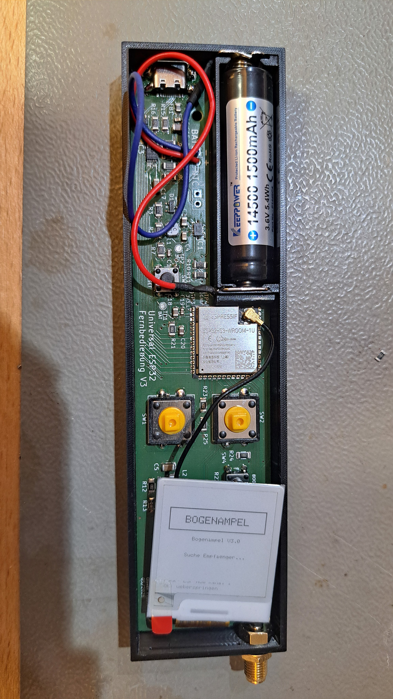
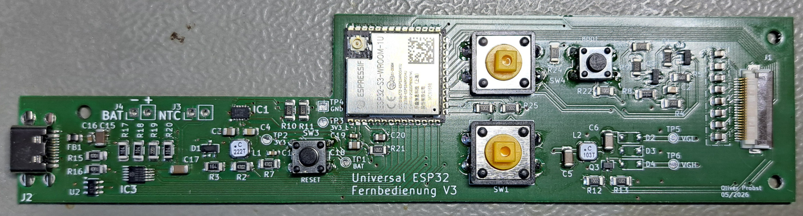
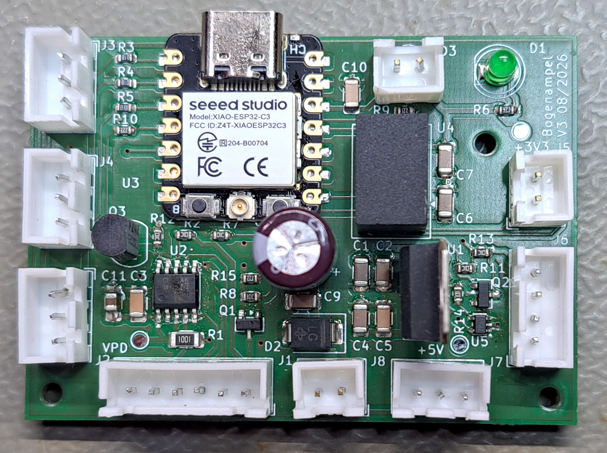
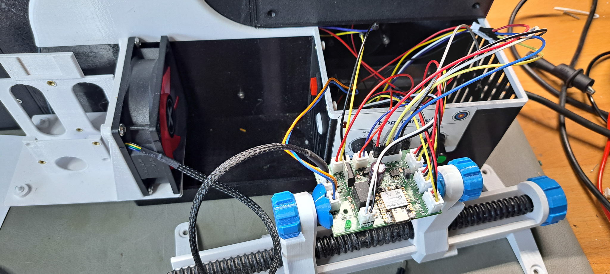
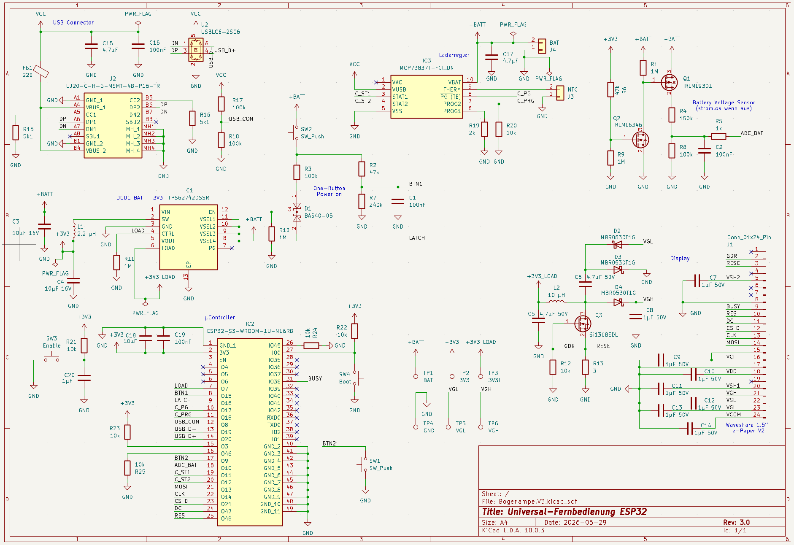
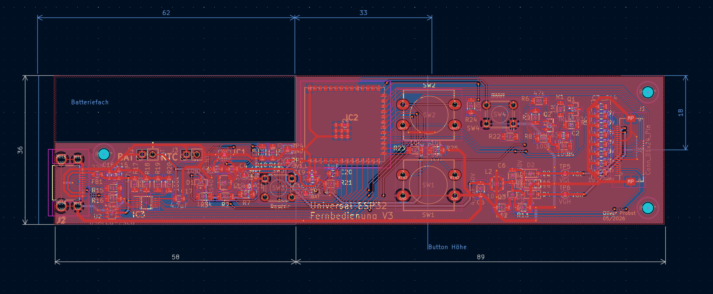

# Bogenampel

Eine funkgesteuerte Timer-Anzeige für Bogenschießplätze — zwei Geräte, zwei Taster,
kein Pairing, kein Netzwerk.

<!-- TODO: Durch ein Foto der fertig montierten Anzeigetafel im Betrieb ersetzen
     (leuchtende 7-Segment-Anzeige). Bis dahin steht hier die geöffnete
     Bedieneinheit, weil sie das Projekt am besten zeigt. -->


---

**Inhalt** — [1. Das Projekt](#1-das-projekt) · [2. Entwicklung](#2-entwicklung)

---

# 1. Das Projekt

## Worum es geht

Auf dem Schießplatz gibt eine Ampel den Takt vor: Rot heißt warten, Grün heißt
schießen, die Restzeit läuft sichtbar herunter. Die Bogenampel macht genau das —
aber ohne Kabel zwischen Schießlinie und Zielbereich, und mit so wenig Bedienung
wie möglich.

An der Bedieneinheit wird einmal der Modus vorgewählt (120 oder 240 Sekunden,
1-2 oder 3-4 Schützen), danach steuern **zwei Taster** den kompletten
Turnierablauf. Die Einstellung überlebt das Ausschalten.

Die Anlage besteht aus zwei Geräten:

- **Bedieneinheit (Sender)** — liegt an der Schießlinie. Akkubetrieben, e-Paper-Display,
  zwei große Taster.
- **Anzeigeeinheit (Empfänger)** — steht am Ziel. Große dreistellige 7-Segment-Anzeige
  aus LED-Streifen, in Ampelfarben, dazu zwei Gruppenbalken.

Dazwischen läuft ESP-NOW auf Kanal 1 — kein WLAN, kein Accesspoint, kein Pairing.
Der Sender sucht den Empfänger beim Einschalten selbst und merkt sich dessen
MAC-Adresse zur Laufzeit.

**Das wichtigste Sicherheitsmerkmal ist ein Stück Nicht-Verhalten**: Der Empfänger
zählt eine gestartete Passe **autonom** zu Ende. Fällt der Funk aus oder geht der
Sender aus, läuft der Timer trotzdem korrekt ab und schaltet danach auf Rot. Die
Anzeige bleibt nie in Grün stehen, nur weil die Verbindung weg ist.

## Die Bedieneinheit

ESP32-S3-WROOM-1U mit externer Antenne am U.FL-Anschluss, 1,54″-e-Paper
(200 × 200, SSD1681), eine 14500-LiIon-Zelle mit MCP73837-Lader und ein
Soft-Power-Latch um einen TPS62742: Einschalten per Taster, Ausschalten übernimmt
die Firmware selbst, sobald sie fertig aufgeräumt hat.
Das e-Paper behält sein Bild ohne Strom — der Abschaltbildschirm bleibt deshalb nach
dem Ausschalten lesbar stehen.



Die Platine trägt den Namen „Universal ESP32 Fernbedienung V3" — sie ist bewusst
etwas allgemeiner gehalten als nötig. Links sitzen Ladeteil und USB-C, in der Mitte
das Funkmodul mit den beiden Tastern, rechts die Ansteuerung für das e-Paper.

## Die Anzeigeeinheit

Ein XIAO ESP32C3 treibt einen WS2811-Streifen mit **66 Pixeln**: 12 für den
Gruppenbalken C/D, 12 für A/B und 3 × 14 für die dreistellige Ziffernanzeige
(2 Pixel je Segment). Versorgt wird alles aus einem USB-C-Netzteil, das über einen
CH224K-Trigger auf **12 V** verhandelt wird.



Drei Potis regeln direkt am Gerät, ohne Umweg über den Funk: **Lautstärke**,
**Helligkeit** und **Lüfterdrehzahl**. Dazu ein Piezo-Transducer für die
Signaltöne und ein temperaturunkritischer, aber hörbarer Lüfter — deshalb regelbar.



## Bedienung

Der Sender hat zwei Taster. Welcher Taster einschaltet, legt der Power-Latch in der
Hardware fest — das ist die **CONFIG**-Taste.

| Taste | kurz | 3× schnell klicken | 3 s halten |
|---|---|---|---|
| **CONFIG** | Weiter / Wert ändern | — | Ausschalten |
| **OK** | Bestätigen / Passe beenden | Alarm | Ausschalten |

Einschalten: CONFIG drücken. Ausschalten: eine der beiden Tasten 3 Sekunden halten.
Die Konfiguration (Schießzeit, Schützenzahl) bleibt im NVS erhalten und steht beim
nächsten Einschalten wieder zur Verfügung.

**Alarm**: die **OK**-Taste dreimal schnell hintereinander drücken (höchstens 0,4 s
zwischen den Klicks). Das geht im Schießbetrieb und beim Pfeileholen — also überall
dort, wo Leute an der Schießlinie stehen können. Im Konfigurationsmenü und im
Startbildschirm bleibt die Folge bewusst wirkungslos. CONFIG löst grundsätzlich
keinen Alarm aus: Diese Taste blättert durch Menüs und zählt Werte hoch, dort ist
zügiges Tippen normale Bedienung. Quittiert wird ein Alarm mit einem kurzen OK.

Ausschalten und Alarm liegen absichtlich auf **verschiedenen** Bewegungen: Halten
schaltet immer aus, egal in welchem Zustand das Gerät gerade ist. Früher hing die
Bedeutung des Haltens am Betriebszustand — wer im Schießbetrieb ausschalten wollte,
löste stattdessen einen Alarm aus.

**Automatische Abschaltung**: Wird im Konfigurationsmenü oder in „Pfeile holen" 60 Minuten
lang keine Taste gedrückt, schaltet sich der Sender selbst ab und zeigt dabei
„Automatische Abschaltung". Im Schießbetrieb und bei stehendem Alarm greift das
bewusst **nicht** — dort läuft eine Passe bzw. ein Sicherheitszustand. Gedacht ist es
gegen das im Koffer vergessene Gerät; dagegen hilft keine Stromsparmaßnahme, nur
Ausschalten.

## Ablauf einer Passe

| Phase | Anzeige | Dauer |
|---|---|---|
| **Stopp** | Rot, `000` | bis zum Start |
| **Vorbereitung** | Rot, Countdown | 10 s |
| **Schießzeit** | Grün, Countdown | 120 s oder 240 s |
| **letzte 30 s** | Orange, Countdown | 30 s |
| **Ende** | Rot, `000` | — |

Der Piezo quittiert die Phasenwechsel mit kurzen Tonfolgen (3250 Hz), das Passenende
mit drei Tönen. Ein ausgelöster Alarm blinkt und piept achtmal.

### Gruppen und halbe Passe

Bei 3-4 Schützen wird zwischen den Gruppen A/B und C/D umgeschaltet; die Anzeige folgt
einem 4er-Zyklus. Zusätzlich lässt sich eine halbe Passe starten, wenn nur noch die
zweite Gruppe schießt. Den Wechsel von der ersten auf die zweite Hälfte vollzieht der
Empfänger selbst, sobald sein Countdown abgelaufen ist — auch das gehört zur
Autonomie-Regel oben.

## Schaltpläne und Platinen

Autoritativ sind die KiCad-Projekte [`Schaltung-Sender/`](Schaltung-Sender/) und
[`Schaltung-Empfaenger/`](Schaltung-Empfaenger/). Die folgenden Exporte sind für alle
gedacht, die ohne KiCad hineinsehen wollen.

**Bedieneinheit (Sender)**





**Anzeigeeinheit (Empfänger)**


---

# 2. Entwicklung

## Hardware-Überblick

| | Sender (Bedieneinheit) | Empfänger (Anzeigeeinheit) |
|---|---|---|
| **Controller** | ESP32-S3-WROOM-1U-N16R8 (16 MB Flash, 8 MB PSRAM) | Seeed XIAO ESP32C3 |
| **Anzeige** | 1.54″ e-Paper, 200×200 (SSD1681) | LED-Strip WS2811 12 V, 66 Pixel |
| **Funk** | ESP-NOW, Kanal 1 (im Chip integriert) | ESP-NOW, Kanal 1 |
| **Versorgung** | LiIon 14500 + MCP73837-Lader, USB-C | USB-C PD 12 V über CH224K (≥ 2 A) |
| **Bedienelemente** | 2 Taster (CONFIG, OK) | Debug-Taster, 3 Potis |
| **Sonstiges** | Soft-Power-Latch (TPS62742) | Piezo 12 V, geregelter Lüfter, Pegelwandler 74AHCT1G125 |
| **Firmware** | [`Sender/`](Sender/) | [`Empfaenger/`](Empfaenger/) |
| **Schaltplan** | [`Schaltung-Sender/`](Schaltung-Sender/) | [`Schaltung-Empfaenger/`](Schaltung-Empfaenger/) |

Die verbindliche Pin-Belegung steht in
[`specs/004-v3-esp32-port/contracts/hardware-pins.md`](specs/004-v3-esp32-port/contracts/hardware-pins.md)
und wird aus den KiCad-Netzlisten abgeleitet. Bei Abweichungen gilt der Schaltplan —
Änderungen gehören zuerst dorthin, dann in den Code.

Die Empfänger-Platine erzeugt aus den 12 V zwei weitere Schienen: ein TSR0.5-2433
versorgt den XIAO mit 3,3 V, ein L7805 den Pegelwandler mit 5 V. Der LED-Strip hängt
direkt am 12-V-Netz — er kann die Logikversorgung also nicht mehr in die Knie zwingen.

## Funk

ESP-NOW auf Kanal 1, ohne externes Funkmodul und ohne Pairing: Der Sender sucht den
Empfänger beim Start per Broadcast und merkt sich dessen MAC-Adresse zur Laufzeit.

Jeder Frame ist 6 Byte groß und trägt Magic-Bytes, eine Prüfsumme und eine
Sequenznummer; der Empfänger verwirft doppelte und fehlerhafte Pakete. Übertragen
werden 11 Kommandos (Start 120/240, Stopp, Init, Alarm, Ping, Gruppenwahl, halbe Passe).
Beim Start misst der Sender die Verbindungsqualität mit 10 Pings und zeigt das Ergebnis
im Splash-Screen.

> **Ein Radio, ein Kanal.** Der ESP32 kann nicht gleichzeitig ESP-NOW auf Kanal 1 und
> WLAN auf einem anderen Kanal betreiben. Deshalb läuft im Normalbetrieb **kein** WiFi —
> weder ein Accesspoint noch eine Netzwerkverbindung. Für Updates gibt es den
> Wartungsmodus (siehe unten).

Die Protokollregeln stehen in
[`espnow-protocol.md`](specs/004-v3-esp32-port/contracts/espnow-protocol.md). Zwei
davon sind beim Ändern leicht zu übersehen:

- **Regel 3**: Ein `CMD_START` wird vom Empfänger ignoriert, solange seine
  Vorbereitungsphase bereits läuft. Beim regulären Gruppenwechsel ist das Kommando
  nur ein Sync-Signal — der Empfänger hat da längst selbst umgeschaltet.
- **FR-004a**: Beim Ablauf der Zeit sendet der Sender **nie** `CMD_STOP`. Das
  Passenende gehört dem Empfänger allein.

## Bauen und Flashen

PlatformIO ist der einzige unterstützte Build-Pfad. Die `platformio.ini` liegt **zentral
im Repo-Root**, nicht in den Firmware-Ordnern — das Repo-Root ist das Arbeitsverzeichnis.
Bibliotheken kommen über `lib_deps`, es muss nichts manuell installiert werden; die
Versionen sind **gepinnt** (FastLED 3.10.3, GxEPD2 1.6.9, Adafruit GFX 1.12.6).

```bash
pio run -e sender                 # bauen
pio run -e empfaenger

pio run -t upload -e sender       # per USB flashen
pio device monitor -e sender      # 115200 Baud

pio run -e sender-release         # Feld-Build: ohne Debug-Ausgaben und CDC-Task
```

Drei Stolpersteine, die alle wie Hardwaredefekte aussehen:

**Beim Sender muss CONFIG während des gesamten Uploads gedrückt bleiben.** Der Reset von
esptool lässt sonst den Power-Latch fallen; das Gerät schaltet sich mitten im Flashen ab
und der USB-Port verschwindet. Zu beachten: `pio run -t upload` startet esptool erst nach
gut einer Minute Build- und Dependency-Scan — so lange muss der Taster gehalten werden.
Praktischer ist, das Gerät **mit gehaltenem CONFIG einzuschalten** (dann greift der
Boot-Lockout und das Halten löst keine Power-Off-Geste aus) und esptool direkt mit den
vier Images aufzurufen.

**Die Upload-Baudrate darf nicht hochgesetzt werden** (`upload_speed = 115200` in der
`platformio.ini`). Der Sender flasht über die native USB-Serial/JTAG-Peripherie, wo die
Baudrate bedeutungslos ist — esptool wechselt beim Board-Default 460800 trotzdem, der Port
re-enumeriert dabei und der Upload stirbt mitten im Stub-Flasher mit
`PermissionError(13) ... Cannot configure port`.

**Unter Windows vor jedem Upload `$env:PYTHONIOENCODING="utf-8"` setzen.** Sonst bricht
der Vorgang mit `UnicodeEncodeError` und `[upload] Error 4294967295` ab — esptool schreibt
Unicode-Fortschrittsbalken, die eine cp1252-Konsole nicht kodieren kann. Auf den Chip
wurde zu diesem Zeitpunkt noch nichts geschrieben.

### Testlauf mit verkürzten Zeiten

Für Tests gibt es eigene Environments: Vorbereitung 5 s statt 10, Schießzeit 6 s statt
120 bzw. 12 s statt 240, Orange-Phase 2 s statt 30. Eine komplette Passe läuft damit in
unter einer Minute durch.

```bash
pio run -t upload -e empfaenger-debug-ota
pio run -t upload -e sender-debug-ota
```

Eingeschaltet wird das über `-DDEBUG_SHORT_TIMES=1` aus der `platformio.ini` — **nicht**
im Quellcode, wo ein `#ifndef`-Guard mit Default 0 steht. So kann ein Build mit
6-Sekunden-Passe nicht versehentlich im Feld landen.

> **Immer beide Geräte umstellen.** Der Empfänger zählt die Passe autonom und bekommt
> per Funk nur `CMD_START_120/240`, nie die Dauer selbst. Die Zeittabelle
> (`Timing::shootingSeconds()`) steht wortgleich in beiden `Config.h` und muss es
> bleiben — sonst endet die Passe auf zwei verschiedenen Sekunden.

### OTA-Wartungsmodus

Beide Geräte lassen sich drahtlos aktualisieren, aber nur in einem eigenen Betriebsmodus —
im Normalbetrieb ist WiFi aus (siehe Kasten oben).

- **Sender**: beide Taster gleichzeitig gedrückt halten und einschalten
- **Empfänger**: mit gehaltenem Debug-Taster (D7) einschalten

Der Sender zeigt daraufhin einen Wartungs-Screen mit WLAN-Status und **seiner eigenen
IP-Adresse**; beim Empfänger signalisiert die Status-LED durch langsames Blinken, dass er
bereit ist. Die IP wird als `upload_port` in der `platformio.ini` eingetragen (eine feste
DHCP-Reservierung ist empfehlenswert, mDNS-Namen lösen über Subnetzgrenzen nicht
zuverlässig auf).

```bash
pio run -t upload -e sender-ota            # Sender, Debug-Build (serieller Monitor bleibt)
pio run -t upload -e sender-release-ota    # Sender, Feld-Build (ohne Debug-Ausgaben/CDC)
pio run -t upload -e empfaenger-ota
```

`sender-release-ota` ist der Auslieferungsweg: gleicher Wartungsmodus, aber das
Image aus `sender-release`. Danach meldet sich kein serieller Port mehr — der
Rückweg auf den Debug-Build geht weiterhin per OTA über `sender-ota`, solange der
Wartungsmodus erreichbar bleibt.

Voraussetzung ist eine `wifi_credentials.h` im Repo-Root — Vorlage:
[`wifi_credentials.h.example`](wifi_credentials.h.example). Die Datei ist bewusst nicht
eingecheckt. Fehlt sie, meldet der Wartungsmodus das auf dem Display und wartet; einen
Accesspoint-Fallback gibt es absichtlich nicht, weil ein zweites Netz auf fremdem Kanal
ESP-NOW stilllegen würde.

Zur Fehlersuche: **ArduinoOTA lauscht auf UDP 3232, nicht TCP.** Ein TCP-Portscan meldet den
Port folgerichtig als geschlossen, auch wenn der Wartungsmodus einwandfrei läuft — daraus
lässt sich also nichts über die Erreichbarkeit ableiten. espota schickt eine UDP-Einladung,
woraufhin das Gerät eine TCP-Rückverbindung zum Host aufbaut.

Der Zugang ist nicht durch ein Passwort geschützt, sondern dadurch, dass der Modus nur mit
physisch gedrückten Tastern erreichbar ist. Grund: Das ArduinoOTA-Passwort (PBKDF2) ist mit
der `espota.py` von PlatformIO nicht kompatibel, die Authentifizierung scheitert stumm.

## Anzeige-Eigenheiten

Zwei Stellen, an denen das naheliegende Verhalten bewusst nicht implementiert ist:

**Das e-Paper blitzt nur beim Start und beim Beenden.** Ein Voll-Refresh (~2,6 s,
schwarz/weiß-Invertierung) läuft nur im Splash und auf dem Abschaltbildschirm. Alles
dazwischen — Menü, Countdown, Pfeile holen, Alarm — nutzt die Partial-Waveform und
bleibt ruhig. Restschatten werden dafür in Kauf genommen und erst beim nächsten
Einschalten weggeblitzt. Die Entwicklungsgeschichte dieser Stelle steht als Kommentar
in `Sender/EpaperDisplay.cpp`; sie ist zweimal in die andere Richtung gelaufen.

**Die Poti-Drehrichtung sitzt an genau einer Stelle**: `Poti::ASCENDING` und
`Poti::level()` in `Empfaenger/Config.h`. Alle Kennlinien rechnen mit der
Reglerstellung, nie mit dem ADC-Rohwert. Wer eine Drehrichtung umdreht, ändert das
Flag — nicht die einzelnen Kennlinien.

## Stromverbrauch des Senders

Gemessen am laufenden Gerät: **0,39 W → 0,20 W**, also etwa doppelte Akkulaufzeit.
Zwei Maßnahmen, beide in der Firmware:

| Maßnahme | Ersparnis |
|---|---|
| CPU-Takt 240 → 80 MHz (`System::CPU_FREQ_NORMAL_MHZ`) | ~10 mA |
| ESP-NOW-Empfangsfenster duty-cycled statt dauerhaft offen | ~38 mA |

Der Löwenanteil war das Funkmodul: ESP-NOW hält den Empfänger per Default dauerhaft an.
Der Sender ist nach der Discovery aber ein reiner Sender — das ACK auf eigene Frames
kommt im Sendefenster zurück, also darf das Empfangsfenster zu bleiben. Während der
Discovery wird es nur um den HELLO-Broadcast herum geöffnet. Details und Voraussetzungen
stehen in [`espnow-protocol.md`](specs/004-v3-esp32-port/contracts/espnow-protocol.md),
Regel 7.

Das **e-Paper ist für den Verbrauch praktisch irrelevant** (unter 2 %) — der
Sekundencountdown im Schießbetrieb ist bewusst nicht angetastet. Nicht möglich ist das
Abschalten des PSRAM: `CONFIG_SPIRAM=1` steckt in allen vorkompilierten
arduino-esp32-Varianten und die Initialisierung hängt nicht an `-DBOARD_HAS_PSRAM`.
Weiter runter käme man nur mit abgeschaltetem Radio zwischen den Kommandos und
manuellem Light-Sleep — die automatische Variante scheidet aus, weil `CONFIG_PM_ENABLE`
in den vorkompilierten Libs fehlt.

## Projektstruktur

```text
platformio.ini          zentrale Build-Konfiguration (beide Geräte)
Sender/                 Firmware Bedieneinheit (ESP32-S3)
Empfaenger/             Firmware Anzeigeeinheit (XIAO ESP32C3)
Schaltung-Sender/       KiCad-Projekt Sender
Schaltung-Empfaenger/   KiCad-Projekt Empfänger
doc/                    Fotos, Schaltplan- und Layout-Exporte
specs/                  Feature-Spezifikationen, Pin-Contract, Abnahme-Checkliste
```

Weiterführend: [`HARDWARE.md`](HARDWARE.md) für die Hardware-Spezifikation,
[`CLAUDE.md`](CLAUDE.md) für die Entwicklungs-Leitplanken und die Änderungshistorie,
[`specs/004-v3-esp32-port/quickstart.md`](specs/004-v3-esp32-port/quickstart.md) für die
vollständige Inbetriebnahme- und Abnahme-Checkliste.

## Bekannte offene Punkte

- **Funk mit geschlossenem Empfangsfenster noch nicht im Turnierablauf verifiziert**: Dass
  das Link-ACK bei `esp_now_set_wake_window(0)` zuverlässig zurückkommt, ist durch die
  Strommessung und den Treiber-Kontrakt gestützt, aber ein vollständiger Durchlauf
  (Start, Gruppenwechsel, Alarm, Stop, Empfänger im Betrieb ausschalten → Relink) steht
  aus. Falls Kommandos zicken: `Radio::PS_WINDOW_CLOSED_MS` in `Sender/Config.h` von 0 auf
  10 setzen — kostet ~10 mA, hält das Fenster aber zu 10 % offen.
- **Restschatten am e-Paper über eine lange Sitzung**: Seit der Voll-Refresh nur noch
  beim Start und beim Beenden läuft, sammelt sich Ghosting über das ganze Turnier an.
  Ob das im Betrieb stört, ist noch nicht beurteilt. Falls ja, wäre ein Voll-Refresh
  beim Verlassen des Schießbetriebs der nächste Kompromiss.
- **Bauteilbezeichner in der Dokumentation**: Im Schaltplan heißen die MOSFETs des
  Empfängers inzwischen **Q1 = AO3401A** und **Q2 = BSS138**. `HARDWARE.md`, die
  Kommentare in `Empfaenger/Config.h` und `FanManager.h` sowie der Pin-Contract nennen
  noch IRLML9301 bzw. 2N7002. Autoritativ ist das KiCad-Projekt.
- **Ladestrom**: Der Sender lädt mit 80–100 mA. Auf 500 mA umschalten geht **nicht per
  Firmware**, auch wenn die Leitung dafür vorbereitet aussieht: Der PROG2-Eingang des
  MCP73837 verlangt für „High" mindestens 0,8 × VDD = 4,0 V (VDD = VUSB = 5 V), ein
  ESP32-GPIO liefert nur 3,3 V — und landet damit im Shutdown-Fenster, der Lader schaltet
  ab. Schnellladen braucht eine Hardware-Änderung (R20 als Pull-up nach VUSB, ggf. mit
  MOSFET zum Umschalten). Details in
  [`hardware-pins.md`](specs/004-v3-esp32-port/contracts/hardware-pins.md), Befund 4.

## Historie

**Version 2** (bis 2026-08-01) basierte auf zwei Arduino Nanos mit nRF24L01+-Funkmodulen,
einem ST7789-TFT am Sender und einer EEPROM-Konfiguration. Timer-Ablauf, Ampelfarben,
Gruppenlogik und die 11 Funk-Kommandos wurden unverändert nach V3 übernommen.

Firmware, Bibliotheken und KiCad-Projekt von V2 wurden aus dem Arbeitsverzeichnis
entfernt und sind über die Git-Historie zugänglich (letzter Stand: Commit `e632bfb`).
Beachte dabei: Die Ordnernamen `Sender/` und `Empfaenger/` bezeichnen **vor** diesem
Zeitpunkt die V2-, danach die V3-Firmware.

```bash
git show e632bfb:Sender/Sender.ino      # V2-Quelltext ansehen
```
